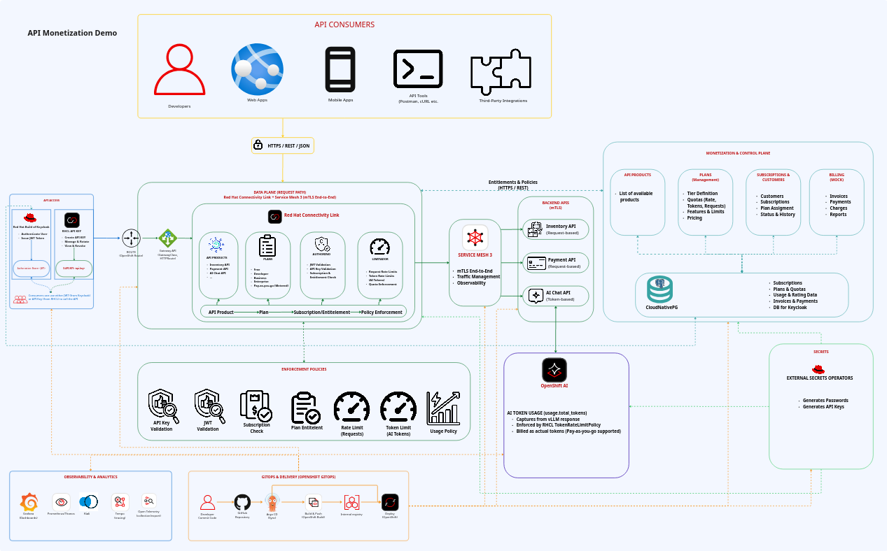

<p align="center">
  
</p>

<h1 align="center">API Monetization on Red Hat OpenShift</h1>

<p align="center">
  Turn APIs and AI inference into governed products with self-service subscriptions,
  live policy enforcement, usage attribution, and visible commercial outcomes.
</p>

<p align="center">
  
  
  
  
  
</p>

<p align="center">
  <a href="docs/architecture.md">Architecture</a> ·
  <a href="docs/deployment.md">Deployment</a> ·
  <a href="docs/demo-runbook.md">Live demo</a> ·
  <a href="docs/golden-paths.md">Golden Paths</a> ·
  <a href="docs/README.md">Documentation</a>
</p>

---

## The experience

A developer discovers a production API in Red Hat Developer Hub, subscribes to
a commercial plan, receives an operator-managed API key or a short-lived
Keycloak JWT, and calls the API through Connectivity Link. Every accepted
request is authenticated, authorized, limited, observed, and attributed to the
correct subscription. A live plan upgrade takes effect on the next request—no
gateway, token, or workload restart is required.

| Persona | Self-service journey | Platform outcome |
| --- | --- | --- |
| **API consumer** | Register → discover → subscribe → obtain API key/JWT → inspect usage and invoices | Subject-scoped access to subscribed production APIs |
| **API owner** | Request owner role → select Golden Path → develop in Dev Spaces → publish | Governed API repository, policies, plans, docs, and GitOps delivery |
| **Platform administrator** | Approve owners → manage plans and subscriptions → observe → audit | Central policy control without putting billing in the gateway |

## What the demonstration proves

| Capability | Visible proof |
| --- | --- |
| 🔐 **Identity and entitlement** | API keys and Keycloak JWTs resolve to the same active subscription |
| 🚦 **Request-time enforcement** | Connectivity Link returns HTTP 401/403/429 before traffic reaches the API |
| ⚡ **Live plan changes** | Free → Developer immediately raises both API-key and already-issued JWT limits |
| 💶 **Real metering** | Only accepted requests become billable; rejected attempts remain observable but unbilled |
| 🤖 **AI token monetization** | OpenShift AI returns actual prompt/completion tokens consumed by `TokenRateLimitPolicy` and billing |
| 🧭 **Golden Paths** | API owners create standalone Go or Camel projects, open them in Dev Spaces, and publish through GitOps |

## Architecture at a glance



<p align="center"><em>Request enforcement stays in the data plane. Products, subscriptions, usage, and billing stay in the commercial control plane.</em></p>

```text
Internet → OpenShift Route → Gateway API → Connectivity Link → Service Mesh → APIs
                                        ↕                      ↕
                                Auth · plans · limits     mTLS · traces
                                        ↕
                    subscriptions · accepted usage · invoices · revenue
```

OpenShift Routes provide the portable public entry point. When MetalLB, a cloud
integration, or another `LoadBalancer` provider is available, the same Gateway
can additionally receive an external address. No LoadBalancer provider or
external DNS setup is required for the baseline.

Read [the architecture guide](docs/architecture.md) for component ownership,
trust boundaries, request lifecycle, billing rules, and the build provenance
chain.

## Platform capability map

| Layer | Components | Responsibility |
| --- | --- | --- |
| Developer experience | Red Hat Developer Hub, Kuadrant plugins, custom monetization plugins, Dev Spaces | Catalog, subscriptions, credentials, billing, Golden Paths, AI playground |
| Identity | Red Hat build of Keycloak | Registration, OIDC/JWT, users, groups, roles, SSO |
| API management | Red Hat Connectivity Link, Authorino, Limitador, Gateway API | API products, authentication, authorization, request and token limits |
| Workload network | Red Hat OpenShift Service Mesh | Strict mTLS, traffic management, telemetry |
| Applications | Inventory, Payment, AI Chat | Independently governed and metered API products |
| AI serving | Red Hat OpenShift AI, KServe, Red Hat vLLM CPU runtime | OpenAI-compatible inference and actual-token reporting |
| Commercial state | CloudNativePG, monetization control plane | Customers, plans, subscriptions, accepted usage, invoices, audit history |
| Observability | Prometheus, Grafana Operator, Loki, Tempo, OpenTelemetry | Business metrics, policy decisions, logs, and traces |
| Secrets | External Secrets Operator for Red Hat OpenShift | Generated passwords and product-scoped API credentials |
| Delivery | OpenShift GitOps, OpenShift Builds | Declarative reconciliation, immutable source revision, in-cluster builds |

## Start on a fresh cluster

### Baseline prerequisites

- OpenShift Container Platform 4.21 or 4.22 and `cluster-admin` access.
- Red Hat, certified, and community Operator catalogs plus the required Red Hat
  product entitlements.
- A default dynamic RWO-capable `StorageClass`.
- The integrated OpenShift registry configured as `Managed`, one replica, with
  a Bound 50-GiB PVC.
- Workstation tools: `oc`, `git`, `make`, `curl`, `jq`, `python3`, and PyYAML.
- Cluster egress to the image registries, npm, GitHub, and—when enabling the CPU
  AI product—Hugging Face model content.

> **Portable by design:** RWX storage, a GPU, MetalLB, and external DNS/TLS are
> not prerequisites. The baseline uses RWO volumes, CPU inference, `ClusterIP`,
> and OpenShift Routes.

### Install and verify

```bash
make validate
make test
make preflight
make bootstrap
make verify
make promotion-status
```

`make bootstrap` is the only imperative installation entry point. It installs
OpenShift GitOps, waits for the current catalog head, and creates the root Argo
CD Application. Operators and operands are separate child Applications so CRDs
become available before their custom resources. Argo CD owns steady state from
that point forward.

See the [deployment guide](docs/deployment.md) for sizing, storage, bootstrap
behavior, verification, upgrades, recovery, and complete removal.

### Cluster planning profiles

| Profile | Control plane | Workers | Persistent capacity | Use |
| --- | --- | --- | --- | --- |
| **Minimum** | 3 × 4 vCPU / 16 GiB | 2 × 8 vCPU / 32 GiB | 75 GiB | Functional installation and single-user validation |
| **Recommended** | 3 × 4 vCPU / 16 GiB | 3 × 8 vCPU / 32 GiB | 100 GiB | Rehearsal and reliable live presentation |
| **Large showcase** | 3 × 8 vCPU / 32 GiB | 3 × 16 vCPU / 64 GiB | 200 GiB | Parallel builds, tests, and development workloads |

Use the [detailed sizing rationale](docs/deployment.md#cluster-sizing) before
installation. A single-node lab requires at least 32 CPUs, 128 GiB RAM, and
200 GiB disk because OpenShift AI sets the governing SNO requirement.

## Run the business demonstration

```bash
make showcase
```

The showcase verifies the platform, proves simultaneous Inventory and Payment
subscriptions, exercises AI Chat with both credential types, reaches genuine
request and token limits, performs a live plan upgrade, creates metered usage
and a draft invoice, prints observability evidence, and restores reusable demo
state—even after interruption.

Focused scenarios are also available:

| Command | Scenario |
| --- | --- |
| `make lifecycle-test` | Suspend, resume, cancel, clean up, and resubscribe with API key and JWT |
| `make multi-product-test` | Independent Inventory and Payment subscriptions and attribution |
| `make ai-monetization-test` | Exact vLLM token attribution through both authentication paths |
| `make ai-demo` | Free AI token quota → HTTP 429 → live Developer upgrade → continue |
| `make demo` | Free request limit → HTTP 429 → live Developer upgrade for API key and JWT |
| `make metered-demo` | Pay-as-you-go traffic, accepted usage, projected revenue, draft invoice |
| `make observe` | Prometheus evidence for commercial state, limits, and gateway responses |
| `make grafana` | Grafana SSO URL and break-glass credentials |
| `make reset-demo` | Return deterministic demo identities to reusable state |

Follow the [live demo runbook](docs/demo-runbook.md) for the presenter narrative,
expected output, manual checks, UI paths, business message, and reset procedure.

## API-owner Golden Paths

Members of `api-owners` receive two governed templates in Developer Hub:

| Template | Generated project |
| --- | --- |
| **Monetized API interface** | Go 1.26 service, API-key and Keycloak JWT OpenAPI contracts, tests, OpenShift build, Service Mesh, Gateway API, Connectivity Link policies, plans, APIProducts, TechDocs, and GitOps |
| **Monetized Camel API integration** | Red Hat Camel Quarkus on Java 21, Kaoto-editable route, authentication-specific OpenAPI contracts, tests, and the same governed platform resources |

Each run creates a dedicated repository in the GitHub organization selected by
the API owner. The owner opens it in OpenShift
Dev Spaces, develops through pull requests, publishes from the Component page,
and receives API-key plus Keycloak JWT presentations only when the APIProduct
and OpenAPI contract are ready. Consumers cannot discover draft projects and
cannot open a production API until they subscribe.

Template 1.4.1 generates all five commercial tiers, lets the API owner set
product-specific prices and limits under pull-request review, and wires accepted
request or AI-token usage into the billing control plane automatically.

See [API-owner Golden Paths](docs/golden-paths.md) for the complete workflow and
security boundary.

## Tested compatibility lane

| Component | Selection |
| --- | --- |
| OpenShift Container Platform | 4.21–4.22 |
| Red Hat Connectivity Link | 1.4 stable, 1.4.1 or later |
| Red Hat OpenShift Service Mesh | 3.4 |
| Red Hat build of Keycloak | 26.6 |
| Red Hat Developer Hub | 1.10 z-stream (`fast-1.10`) |
| Red Hat OpenShift Dev Spaces | Latest `stable` channel z-stream |
| Red Hat OpenShift AI | 3.4 stable, 3.4.3 starting CSV |
| cert-manager Operator for Red Hat OpenShift | 1.19 |
| External Secrets Operator for Red Hat OpenShift | 1.2 |
| CloudNativePG certified Operator | 1.30 |
| Red Hat build of OpenTelemetry / Tempo | Stable tested channels |
| Grafana Operator | v5, 5.24.0 starting CSV |
| Red Hat OpenShift GitOps | Latest catalog channel, automatic upgrades |
| Application build toolchain | Red Hat UBI 9 Go Toolset 1.26.5 |

Compatibility versions are reviewed as a set. `make preflight` validates the
cluster and Operator catalog before making changes.

## Repository map

| Path | Purpose |
| --- | --- |
| [`bootstrap/`](bootstrap/) | One-time OpenShift GitOps and root Application installation |
| [`gitops/applications/`](gitops/applications/) | App-of-apps definitions and reconciliation waves |
| [`operators/`](operators/) | OLM Subscriptions and OperatorGroups |
| [`platform/`](platform/) | Operator-managed operands, identity, gateway, data, and observability |
| [`applications/`](applications/) | Inventory, Payment, AI Chat, and commercial control-plane source/builds |
| [`golden-paths/`](golden-paths/) | RHDH templates and standalone generated-project skeletons |
| [`policies/`](policies/) | Authentication, authorization, request, and token policies |
| [`dashboards/`](dashboards/) | Business and platform observability assets |
| [`environments/`](environments/) | Environment-specific composition and configuration |
| [`scripts/`](scripts/) | Validation, bootstrap, verification, demo, and cleanup automation |
| [`docs/`](docs/README.md) | Architecture, deployment, runbook, data model, and decisions |

## Documentation

| Guide | Read it when… |
| --- | --- |
| [Documentation home](docs/README.md) | You need a map of all guides and architecture decisions |
| [Architecture](docs/architecture.md) | You need responsibilities, trust boundaries, data flow, or billing behavior |
| [Deployment](docs/deployment.md) | You are preparing, installing, validating, recovering, or removing a cluster |
| [Live demo runbook](docs/demo-runbook.md) | You are rehearsing or presenting the complete story |
| [Golden Paths](docs/golden-paths.md) | You are creating and publishing a new monetized API project |
| [Subscription model](docs/data/subscription-model.md) | You need the commercial entities and lifecycle constraints |

## Design principles

- **GitOps is the contract.** Desired state, policy, dashboards, and promotion
  metadata live in Git; OpenShift GitOps is the steady-state reconciler.
- **Operators own platform services.** Every Red Hat component—and every other
  operator-capable service—is installed and managed through OLM.
- **The gateway is not a billing database.** Request-time enforcement consumes
  narrow entitlement metadata; rating and invoicing stay asynchronous.
- **Commercial identity is live.** Keycloak proves identity while PostgreSQL
  owns current product, plan, and subscription state.
- **Accepted usage is billable usage.** HTTP 429 attempts are observable but do
  not reach the workload and never appear on an invoice.
- **Fresh-cluster reproducibility is continuously tested.** Kustomize rendering,
  application tests, Golden Paths, and checksum-pinned RHDH plugins run in CI.

The checked-in profile is intentionally optimized for a portable demonstration.
Production PostgreSQL HA/backups, external TLS/DNS, object storage, payments,
and disaster recovery should be added through a separate reviewed overlay.

---

Licensed under the [Apache License 2.0](LICENSE).
