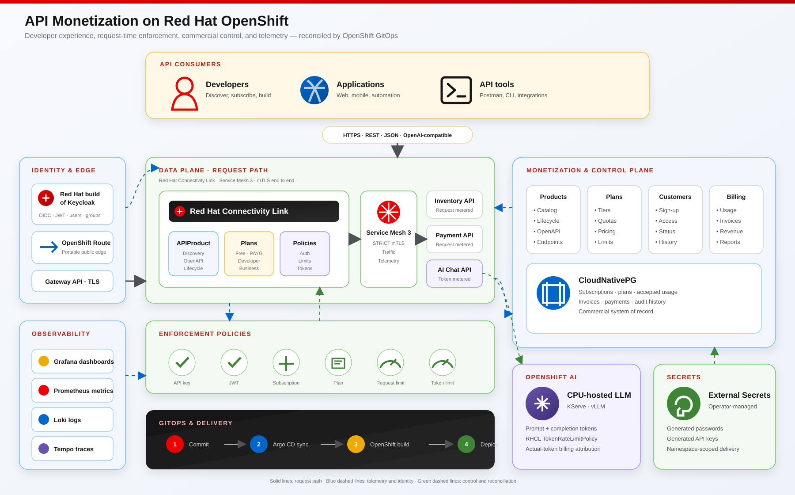

# API Monetization documentation

[Project home](../README.md) · [Architecture](architecture.md) · [Deploy](deployment.md) · [Demo](demo-runbook.md) · [Golden Paths](golden-paths.md)

> A practical guide to the complete API product lifecycle on Red Hat OpenShift:
> from developer onboarding and API publication to request enforcement, usage
> attribution, live plan changes, and billing evidence.

## Choose your journey

| I want to… | Start here | Outcome |
| --- | --- | --- |
| Understand the system | [Architecture](architecture.md) | Component ownership, trust boundaries, request flow, billing, and promotion model |
| Install on a fresh cluster | [Deployment guide](deployment.md) | Prerequisites, sizing, bootstrap, verification, recovery, and complete removal |
| Present the business story | [Live demo runbook](demo-runbook.md) | Repeatable API-key, JWT, metering, AI-token, upgrade, and observability scenarios |
| Create a new API product | [API-owner Golden Paths](golden-paths.md) | Contract-first Go or Camel integration repository, Dev Spaces, GitOps, and publication |
| Understand commercial data | [Subscription model](data/subscription-model.md) | Customers, subscriptions, credentials, usage, invoices, and lifecycle boundaries |
| Review design choices | [Architecture decisions](#architecture-decisions) | Why the platform uses Operators, GitOps, PostgreSQL, RHDH, OpenShift AI, and reviewed onboarding |

## Platform map

| Experience | Red Hat platform responsibility | Project responsibility |
| --- | --- | --- |
| Developer portal | Red Hat Developer Hub, Keycloak, Kuadrant plugins, Dev Spaces | Subject-scoped subscriptions, billing UI, Golden Paths, branded sign-in |
| API enforcement | Connectivity Link, Authorino, Limitador, Gateway API | Product policies, entitlements, request and token plans |
| Workload security | OpenShift Service Mesh | Strict mTLS, routing, workload telemetry |
| AI product | OpenShift AI, KServe, Red Hat vLLM runtime | OpenAI-compatible facade, response-token attribution, AI plans |
| Commercial control | CloudNativePG | Customers, plan state, accepted usage, invoices, audit history |
| Operations | OpenShift GitOps, External Secrets, OpenTelemetry, Grafana, Tempo | Reproducible delivery, generated credentials, dashboards, logs, and traces |

## Architecture decisions

| Decision | Summary |
| --- | --- |
| [ADR 0001](decisions/0001-gitops-and-operators.md) | GitOps and Operator ownership |
| [ADR 0002](decisions/0002-secrets-and-postgresql.md) | Secret and PostgreSQL operators |
| [ADR 0003](decisions/0003-portable-demo-profile.md) | Portable OpenShift edge and observability profile |
| [ADR 0004](decisions/0004-operator-managed-grafana.md) | Operator-managed Grafana baseline |
| [ADR 0005](decisions/0005-grafana-keycloak-sso.md) | Keycloak SSO for Grafana |
| [ADR 0006](decisions/0006-cpu-ai-model-serving.md) | CPU-only model serving with OpenShift AI |
| [ADR 0007](decisions/0007-ai-chat-playground.md) | Browser AI playground and repeatable token-quota demo |
| [ADR 0008](decisions/0008-rhdh-developer-experience.md) | RHDH as the unified developer experience |
| [ADR 0009](decisions/0009-reviewed-rhdh-onboarding.md) | Self-service consumers and reviewed API owners |

## Documentation conventions

- Commands are intended to run from the repository root unless stated otherwise.
- `make validate` is cluster-independent and safe to run before every push.
- `make preflight` is read-only and checks the selected OpenShift cluster.
- `make bootstrap` is the only imperative installation entry point; Argo CD owns
  steady-state resources after bootstrap.
- The documented baseline is a portable demo profile. Production HA, backup,
  external DNS/TLS, object storage, and disaster recovery belong in a separate
  environment overlay.

---

[Back to project home](../README.md)
